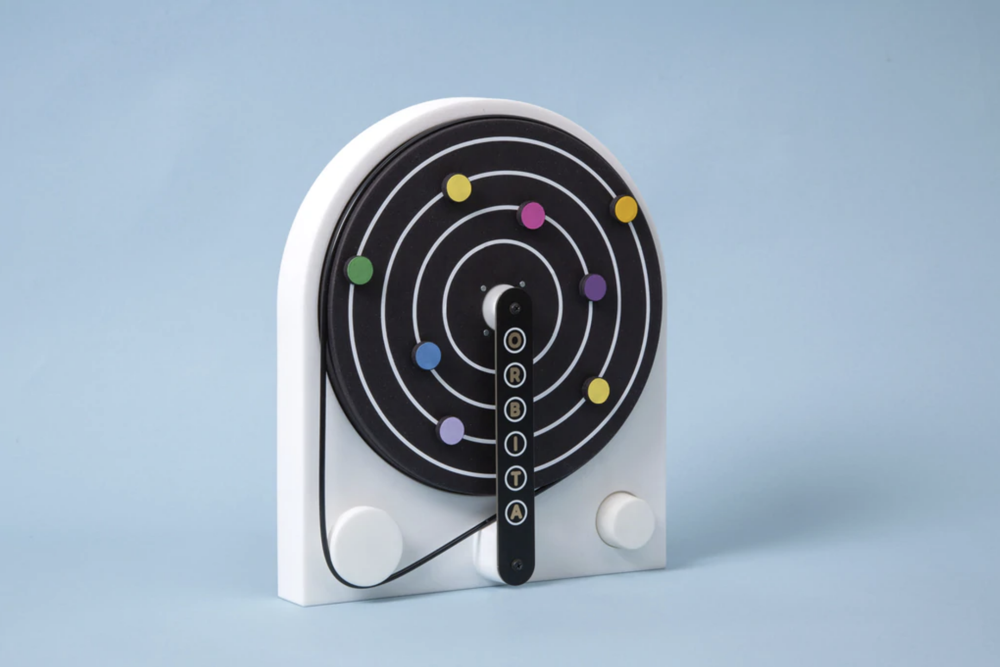
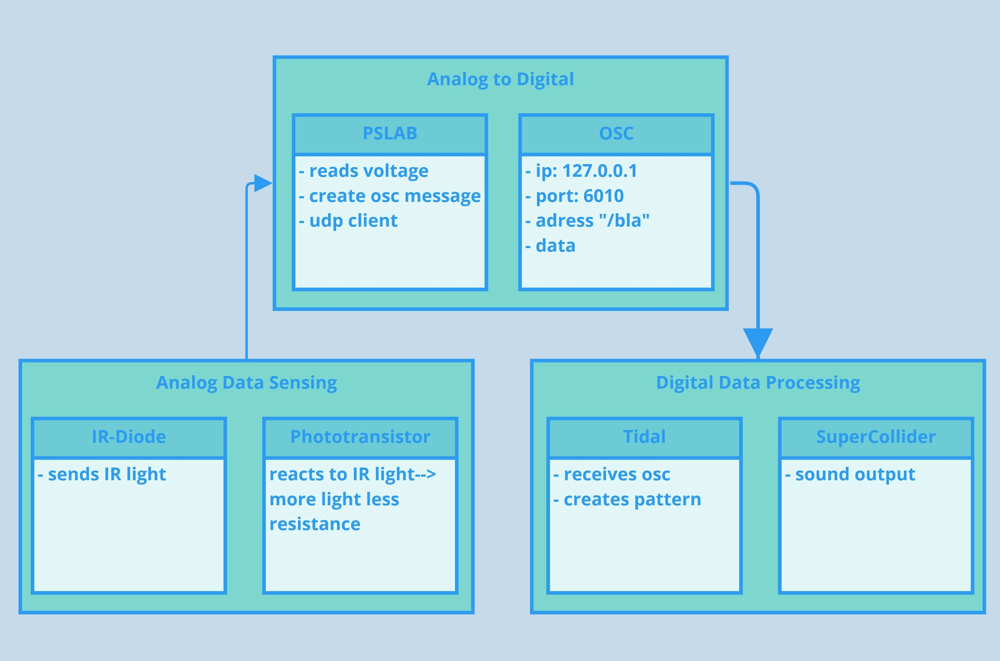
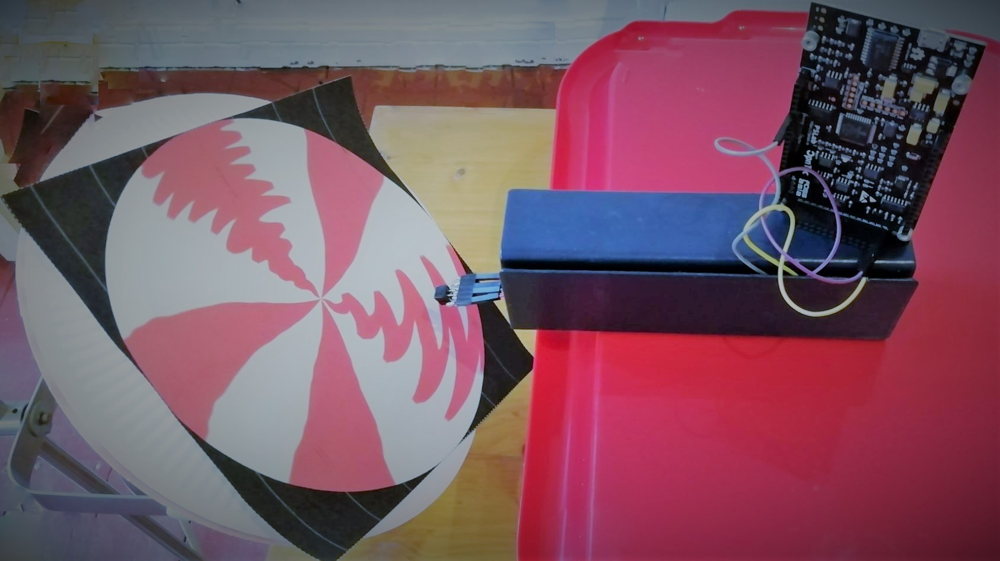
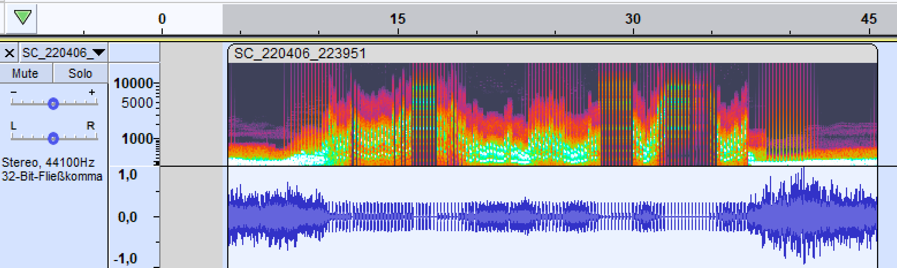

# Draw your record and hear how it sounds

## We are here because...

We, [Sara Reichert](https://www.nue.tu-berlin.de/index.php?id=222340) and [Daniel Wessolek](https://www.danielwessolek.com/pro/about/) had a walk!

# 👩🏻‍🔧️ ⁉️ ❤️ 🚀️🛰️

Hi. 
I am Sara. I like space travel/NASA and #OpenHardware.
I am an Electrical Engineer and a researcher at TU Berlin and develop a tool that makes prototyping as easy as using a spoon.

🧔🏼️ ⁉️ ❤️ 📠️
Hi. I am Daniel. I like #OpenHardware. I am a (Tangible)
Interaction Designer. I work for an EU-funded project called
OPENNEXT* (opennext.eu). This is also how I started
working on the Pocket Science Lab and how I got in touch Orbita.
*This project has received funding from the European Union’s Horizon
2020 research and innovation programme under grant agreement no.
869984.

Have a look:
+ Open Source Hardware [Open!Next](https://opennext.eu/)
+ Our Inspiration [Orbita](https://shop.playtronica.com/pages/new-device-orbita)

## The relationship of sound and its medium has a long history

[Source](http://www.medienkunstnetz.de/werke/phonograph/bilder/1/)

Listen to Edison: [Edisons Phonograph](http://www.medienkunstnetz.de/werke/phonograph/audio/2/)

## Design of the circuit

- CNY70 Phototransistor + IR-LED
- Resistor 150R
- Resistor 10K

And the Sound? Suggestions:

- Connect Output with the OSHW [Atari Punk Console](https://www.instructables.com/Build-an-Atari-Punk-circuit-on-a-breadboard/)
- Connect Output in the analog Port of a microcontroller and send it to tidalcycles

## Design of a record

#### This GIMP drawing

#### ...turns into this record by applying the "Polar Coordinates" filter 

#### Turns out visual methods like these are also a classic way of adjusting the record player's speed

[Source](https://twitter.com/Dead9VBattery/status/1508863597807640584/photo/3)

## Pocket Science Lab

## Open Sound Control
+ Invented by Matt Wright and Adrian Freed at Stanford Center for New Music & Audio Technologies (CNMAT)
+ They proposed OSC in 1997 as “a new protocol for communication among computers, sound synthesizers, and other multimedia devices that is optimized for modern networking technology”.

## Tidal Cycles
+ [TidalCycles](https://tidalcycles.org/)
+ Daniel playing as Geraniendunger at the algorave 10th birthday party ❤️📢️  https://archive.org/details/algorave-10-geranienduenger
+ Quick demo by Daniel

## Demo

- connect drawsoundmachine with +,- and voltmeter of Pocket Science Lab
- this python code will send data to Tidal [pslab2tidalcycles](https://github.com/Sarapedia/pslab/blob/main/DrawRecord/pslab2tidalcycles_FOSSASIA_record.py)
- open Super Collider 
- open your favourite code editor with Tidal support
- write: d1 $ s "kurt*4" #speed ((cF 0.8 "VOLT"))
### Experiment

### Results

Listen to [RedWhite mp3](https://github.com/Sarapedia/pslab/blob/main/DrawRecord/redwhite.mp3)

