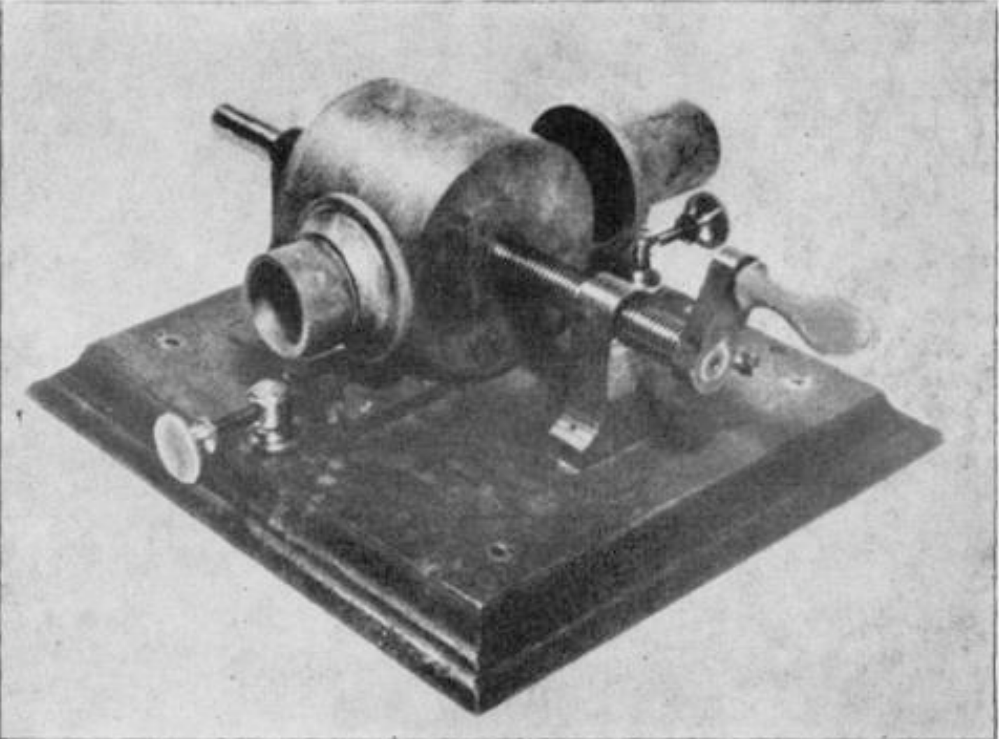

# Draw your record and hear how it sounds

## We are here because...

We, [Sara Reichert](https://www.nue.tu-berlin.de/menue/mitarbeiterinnen/) and [Daniel Wessolek](https://www.danielwessolek.com/pro/about/) had a walk!

Have a look:
+ Open Source Hardware [Open!Next](https://opennext.eu/)
+ Our Inspiration [Orbita](https://shop.playtronica.com/pages/new-device-orbita)

## The relationship of sound and its medium has a long history

[Source](http://www.medienkunstnetz.de/werke/phonograph/bilder/1/)

Listen to Edison: [Edisons Phonograph](http://www.medienkunstnetz.de/werke/phonograph/audio/2/)

## Design of the circuit

- CNY70 Phototransistor + IR-LED
- Resistor 150R
- Resistor 10K

And the Sound? Suggestions:

- Connect Output with the OSHW [Atari Punk Console](https://www.instructables.com/Build-an-Atari-Punk-circuit-on-a-breadboard/)
- Connect Output in the analog Port of a microcontroller and send it to tidalcycles

## Design of a record

#### This GIMP drawing

#### ...turns into this record by applying the "Polar Coordinates" filter 

#### Turns out visual methods like these are also a classic way of adjusting the record player's speed

[Source](https://twitter.com/Dead9VBattery/status/1508863597807640584/photo/3)

## Pocket Science Lab

## Open Sound Control
+ Invented by Adrian Freed

## Tidal Cycles
+ [TidalCycles](https://tidalcycles.org/)

## Demo
- connect drawsoundmachine with +,- and voltmeter of Pocket Science Lab
- this python code will send data to Tidal [pslab2tidalcycles](https://github.com/Sarapedia/pslab/blob/main/DrawRecord/pslab2tidalcycles_FOSSASIA_record.py)
- open Super Collider 
- open your favourite code editor with Tidal support
- write:
